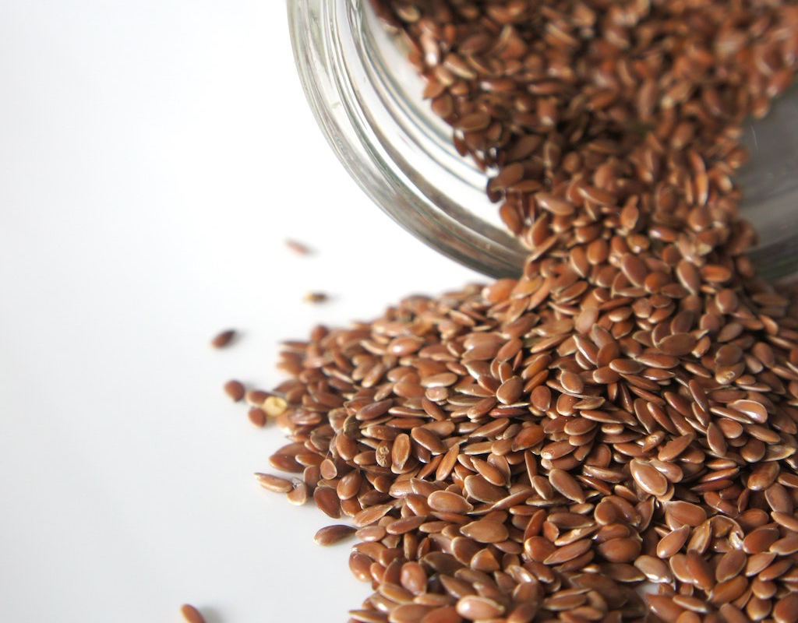
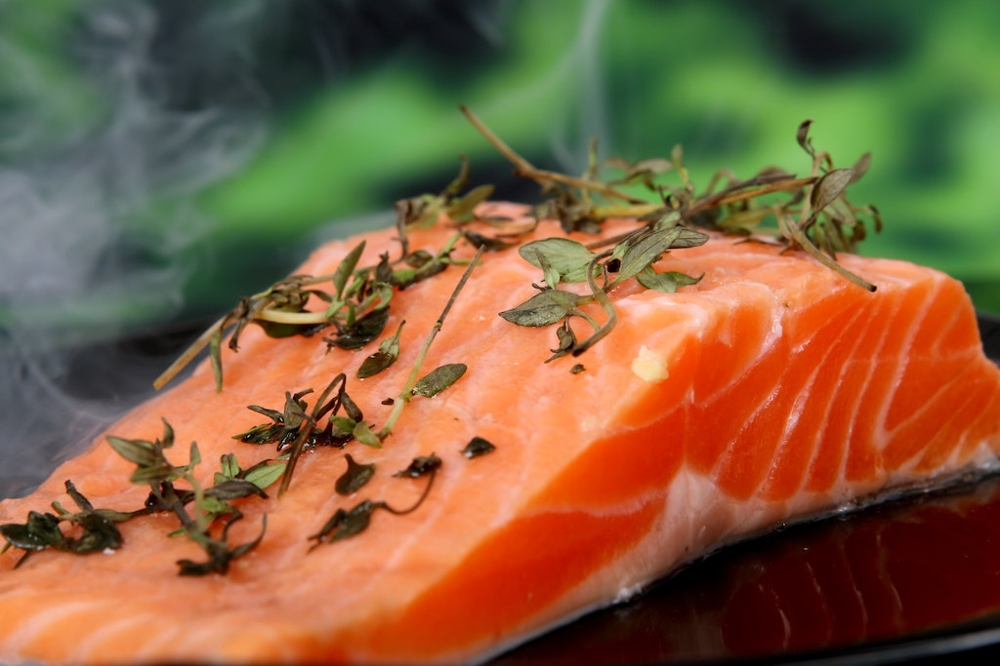
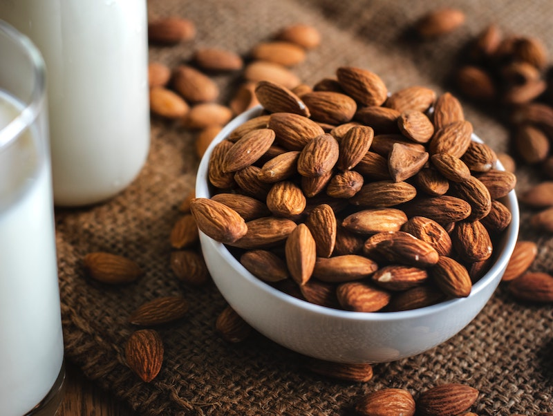
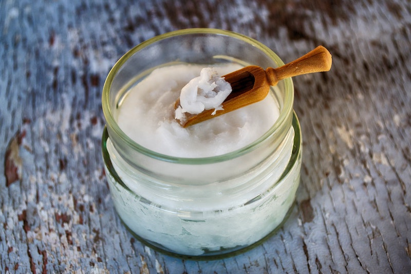

import { BlogLink } from '$components/Link';
import { Title, Subtitle, Divider } from '$components/mdx';

Hormones **control nearly every aspect for our body**, from how we feel to how much energy we have during the day or how easily we are losing that little christmas pooch. 

They play a profound role in your appetite, weight, and mood just to mention a few areas of work. 

Your endocrine system, that is responsible for the hormone production, does a terrific job producing the right amount of each hormone - that is, if nothing is throwing it off the track.

These days, hormonal imbalances have become increasingly common due to **high levels of stress, lifestyle toxins, or an unhealthy diet**. Additionally, as women we are naturally riding a hormonal roller coaster not only throughout our menstrual cycle but throughout our lives. With age, certain hormones decline and the symptoms of that vary for every woman.

Fortunately, a **nutritious diet and a healthy, stress-free lifestyle** may help improve hormonal balance, helping you to feel thriving and energized again.

That’s why I created a list of **food that helps to balance your hormones naturally**. Try to incorporate these healthy ingredients into your diet as often as possible to feel more energized, healthy, and to maybe lose a few pounds on the way.

<Subtitle id="balance-hormones-flax-seeds">#1 Flax Seeds</Subtitle>

Flax seeds are **rich in the healthy anti-inflammatory omega-3 fatty acids**. They are also the greatest source of lignans, a type of phytoestrogen which is a plant nutrient that is somewhat similar to the female estrogen. It mimics estrogen, binds to the estrogen receptors and **help decrease the level of estrogen in the blood**.

 

These lignans can also change estrogen metabolism. In postmenopausal women, they can even cause the body to produce less active forms of estrogen, which is believed to reduce the risk of breast cancer. 

Try to incorporate **two teaspoons of flax seeds** into your diet. They make a great addition to any smoothie or in your daily breakfast bowl. 

<Subtitle id="balance-hormones-broccoli">#2 Broccoli</Subtitle>

Broccoli is another great veggie when it comes to **balancing female sex hormones**. It is part of the cruciferous family of vegetables which is rich in glucosinolates, a natural component of many pungent plants. 

Glucosinolates hydrolysis products are said to “**alter the metabolism or activity of sex hormones in ways that could inhibit the development of hormone-sensitive cancers**”. However, further research needs to be done. (<BlogLink to="https://www.ncbi.nlm.nih.gov/pubmed/9865427">1</BlogLink>, <BlogLink to="https://www.ncbi.nlm.nih.gov/pmc/articles/PMC2737735/">2</BlogLink>)

Broccoli is also rich in isothiocyanates, small molecules that are formed from glucosinolate precursors. They are said to **exhibit anti-tumor  activity and to reduce activation of carcinogens** as well as to increase their detoxification. (<BlogLink to="https://www.ncbi.nlm.nih.gov/pmc/articles/PMC4002831/">1</BlogLink>)

With its high amounts of fibre, broccoli also helps to **eliminate excess estrogen through our bowel movements**.

<Subtitle id="balance-hormones-wild-salmon">#3 Wild Salmon</Subtitle>

Overall, our diet often mainly consists of omega-6 fatty acids rather than omega-3. However, for optimal health our ratio should be anything close to 1:1.  

Wild salmon is one of the greatest sources of **omega-3 fatty acids** there is. These fats are **essential for the production of hormones that regulate heart, blood, and genetic function**. 

Salmon is also an excellent source of **Vitamin D**, the fat-soluble vitamin that helps us **make our sex hormones** and boost testosterone levels in men. (<BlogLink to="https://www.ncbi.nlm.nih.gov/pubmed/28041602">1</BlogLink>, <BlogLink to="https://www.ncbi.nlm.nih.gov/pubmed/21154195">2</BlogLink>)

<Subtitle id="balance-hormones-seaweed">#4 Seaweed</Subtitle>

The trace mineral **iodine** plays an important role in the **synthesis of the primary thyroid hormone thyroxine**. Studies claim that severe iodine deficiency as well as excess iodine is associated with **thyroid dysfunctions**, especially in vulnerable patients with specific risk factors, including those with pre-existing thyroid-disease, the elderly, fetuses and neonates. (<BlogLink to="https://www.ncbi.nlm.nih.gov/pmc/articles/PMC4049553/">1</BlogLink>, <BlogLink to="https://www.ncbi.nlm.nih.gov/pmc/articles/PMC4729155/">2</BlogLink>, <BlogLink to="https://www.ncbi.nlm.nih.gov/pmc/articles/PMC3976240/">3</BlogLink>)

In adults who are not pregnant or lactating, the recommended daily intake of iodine is **150 μg**. Seaweeds are an excellent source of iodine as well as other nutrients as they virtually contain all the minerals found in the ocean. 

<Subtitle id="balance-hormones-avocados">#5 Avocado</Subtitle>

Avocado is definitely the fruit of the year and rightly so. They are rich in **vitamins C, E, K, and B-6 and contain omega-3 fatty acids** - the healthy fat. 

Avocados also have an effect on your **female sex hormones, estrogen and progesterone**. Their key plant sterols can **reduce excess estrogen** as they tend to block estrogen absorption  and **promote progesterone production** in women. 

Additionally, the beta-sitosterol found in avocados **balances our stress hormones cortisol** produced by the adrenal glands. 

Every time you’re stressed out, the adrenal glands start to produce more cortisol that is then being pumped throughout your body. Anytime you can balance your stress levels, you’re doing your body a huge favor. And there are definitely worse ways to balance your hormones than eating avocados. 

<Subtitle id="balance-hormones-quinoa">#6 quinoa</Subtitle>

Another hormone balancing food is quinoa. It’s a **complex carbohydrate with high levels of protein** that can help keep your **blood sugar levels** steady.

When possible, substitute quinoa for other grains like wheat or white rice. This will help you keep your insulin levels at an appropriate level thus keeping androgen hormone levels (“male” hormones like testosterone) balanced.

<Subtitle id="balance-hormones-almonds">#7 Almonds</Subtitle>

Containing high amounts of **omega-3 fatty acids** and other nutrients, nuts are a naturally healthy snack. To balance your hormones, dieticians often point to almonds in particular, as they can **increase your body’s adiponectin hormone**. 

The adiponectin hormone is responsible for **regulating blood sugar levels** which helps keeping insulin in check. 

Studies show that adiponectin **enhance insulin sensitivity** through increased fatty acid oxidation and inhibition of hepatic glucose production. Improving your insulin sensitivity can **reduce the risk of many seriouses diseases such as diabetes, cancer, heart attacks, and strokes**. (<BlogLink to="https://www.ncbi.nlm.nih.gov/pubmed/15655035">1</BlogLink>)

<Subtitle id="balance-hormones-naturally-bell-peppers">#8 Bell Peppers</Subtitle>

Bell Peppers are loaded with **Vitamin C**, an antioxidant vitamin that is essential to the function of the **adrenal glands**. (<BlogLink to="https://www.ncbi.nlm.nih.gov/pubmed/15666839 ">1</BlogLink>)

The highest amount of vitamin C in our body can be found in the adrenal glands. The more stressed we are, the more cortisol is being produced and the more vitamin C is being used. 

Vitamin C-rich foods like bell peppers help us re-fill our vitamin C storage and with its good numbers of **B vitamins** you’ll get an energy boost. Vitamin B also helps reduce stress levels which literally puts less stress on our adrenal glands. 

<Subtitle id="balance-hormones-naturally-coconut-oil">#9 Coconut Oil</Subtitle>

Coconut oil is amazing for hormonal health. It plays a key role in hormone regulation as it **can help convert cholesterol into pregnenolone**. 

Pregnenolone is a precursor hormone as it is the starting material in the production of progesterone, estrogen, testosterone and other hormones. Thus balancing pregnenolone might have a positive impact on your overall hormonal balance. 

Coconut oil is also high in **lauric acid** which **inactives harmful microbes** in the gut. These microbes may lead to hormonal imbalance thus inactivating them is a powerful step towards hormonal balance (<BlogLink to="https://www.ncbi.nlm.nih.gov/pubmed/24328700">1</BlogLink>). Coconut oil also promotes the growth of good bacteria in the gut and repairs gut tissue. 

<Divider/>

Can you see how powerful food is when it comes to our health? Food is medecine, we just have to know how to use it right. 

