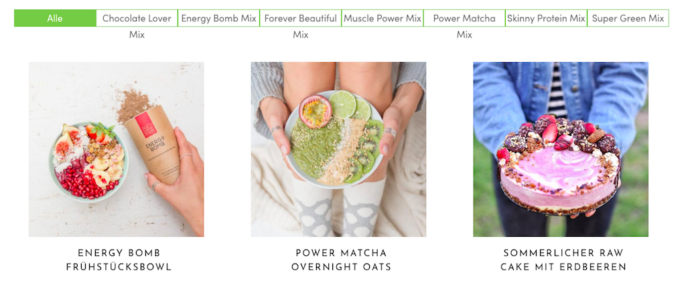
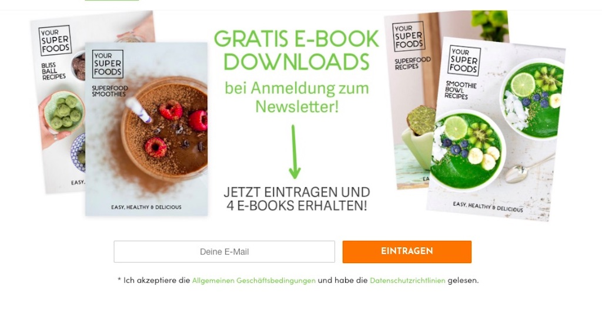
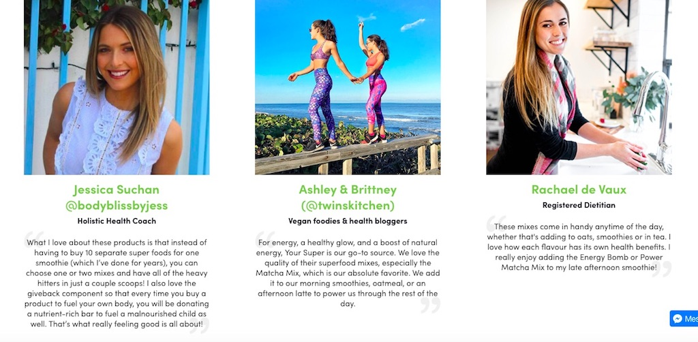
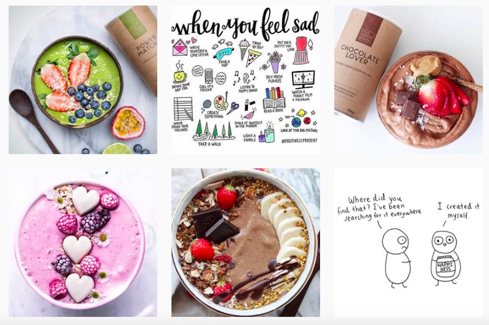

import YouTube from 'react-youtube';
import { BlogLink } from '$components/Link';
import { Title, Subtitle, Divider } from '$components/mdx';

Using Content Marketing to attract more customers? The nutrition and supplementary company Your Superfoods demonstrates how it’s done. I will show you how Your Superfoods uses Content Marketing Strategies by showing various food marketing examples deployed by them to get more people to eat healthy and buy their food products.

Buying dietary supplements isn’t for everybody. It needs trust in a product, in a company, and in a lifestyle that might benefit you in order to make a sell. That’s why it is important to build a trustworthy relationship with customers right from the start. Your Superfoods is exactly doing that with their content marketing.

Content Marketing has proven to be a smart strategy when it comes to building trust and then closing the deal. In fact, 61 percent of US online consumers said that <BlogLink to="https://contentmarketinginstitute.com/2017/10/stats-invest-content-marketing/">they made a purchase after having read recommendations on the blog</BlogLink>.

Your Superfoods has effectively applied these content marketing strategies. Newsletters, social media, e-books, blog, and testimonials - the fundamentals for the best food content marketing. Your Superfood does it all: They build upon these fundamentals to follow the latest food marketing trends to evolve their content marketing around food related content.

<Title id="food-content-marketing-storytelling">Storytelling in Food Content Marketing</Title>

One of the most important stories to tell in content marketing is the story about oneself, about the people behind a company. This story is not supposed to sell anything; it’s a way to build trust and a relationship with your customers. In this story you share your passion, your “why” you are doing something. This story will become the foundation for all the content to come. It’s one of the major pillars before building upon this with your domain specific (food) content marketing.

A great story helps you explain what it is that makes your product, company or service unique. You can share your passion and your ambition in a very compelling way. As humans we thrive for personal relations, hence knowing the people behind a product, service or company helps to become more relatable.

Your Superfoods teasers the founders story very prominently on the main site. It’s a story about hope and power - about a young man getting sick and his girlfriend who stays strong and provides him with loose bags of dietary supplements in order to keep him strong, too. This emotional and personal story makes the founders approachable and relatable. It connects the buyer and seller with emotions yet also value.

<Title id="food-content-marketing-emotions">The Power of Emotions in Content Marketing</Title>

At the heart of every good story are emotions and the story of the two founders of Your Superfoods is full of it. Emotions have a huge impact on what we buy. In fact, <BlogLink to="https://blog.thesocialms.com/power-emotions-in-content-marketing-reactions/">our buying decision are 80 percent emotional and only in 20 percent based on logic</BlogLink>. When we’re evaluating brands, we’re primarily using emotions rather than facts and information. Thus, triggering a particular emotion can help you win over a new customer and savvy marketers know how to do that.

<YouTube
  videoId="ad-9H0IDGhU" opts={{ width: '100%' }}
/>

Your clients need to get the feeling that you are there for them to help solve a nagging problem or reach a goal. Facts and sheets just aren’t enough to persuade them to make a purchase. Emotions do a better job here.

Your Superfoods does that really well. They start off with this really emotional story about the founders cancer diagnosis and then explain how nutrition helped him stay strong. And it wasn’t just a random dietary supplement that his girlfriend (which actually makes the story even better) bought for him. She mixed them all by herself. She read and learned about the most vital nutritions and mixed healthy and delicious smoothies, muslis and more for her boyfriend. Thus, Your Superfoods’ storytelling has everything a good story needs: love, hope, excitement, strength.

<Title id="food-content-marketing-educational">Informing & Educational Food Content</Title>

As almost every startup these days, yoursuperfoods, too, has a blog on their website. They use it to share delicious recipes that feature their supplements. That’s a smart move as blogs are a good start towards educating your audience about your products and services. It gives your customer a sense of caring before they even bought anything. It’s the start of building a great relationship with your target group.

With this blog, your Superfoods strengthen their brand, they earn natural backlinks, because they are providing profound value, and as result increase their organic traffic. They’ve also understood, that a blog is all about creating value for the customer without asking anything in return. That’s why all their blog posts are high quality and focus on the audience’s needs.

My personal food content marketing idea for Your Superfood: “How To Make The Best” is a frequent Google search. Leverage this knowledge by providing the best food recipes around supplementary food from Your Superfoods.

<Title id="food-content-marketing-ebooks">Even more Content: Supplementary eBooks</Title>

The content doesn’t stop with blog posts. Your Superfoods also regularly publishes e-books with yummy smoothie-, bliss ball-, superfood- and smoothie bowl recipes. Of course, all of these recipes feature their supplements but not in a salesy way and they simply look extremely delicious. All a customer has to do to get these e-books is to opt-in with their contact information. That’s a very smart move as email addresses are worth a mint these days to grow a mailing list.

These e-books also substantiate Your Superfoods’ authority in the field of supplements as experts much more than a blog post allows. Furthermore, their vast popularity and perceived high value have made them very popular among (small) business owners. Neil Patel, digital Marketing expert, even lists <BlogLink to="https://neilpatel.com/blog/beginners-guide-to-content-based-lead-generation/">eBooks as the second best strategy to create leads with content</BlogLink>.

My personal food content marketing idea for Your Superfood: Selling e-books on Amazon is a great way to drive traffic to your website and position yourself as an expert in your field. Start giving out eBooks with ‘normal’ recipes for free and add your supplements as extra boost. Then drive readers back to Goodreads and Amazon after reading the books to leave a good review for it. That will give you even more authority and social proof. Also, add a link in your eBook to your website for additional information, (e.g. this recipe uses X, you should read more about X on our website) or extras to generate even more traffic.

<Title id="food-content-marketing-newsletter">Newsletter to drive Traffic and Conversions</Title>

Every two to three days Your Superfoods sends out a new newsletter. You might say now: Whoa, that’s quite a lot! After all, nobody wants more email, right? But those aren’t those annoying newsletter that you want to opt out of right away or that you only subscribed to for the discounts anyway. They are informative and a source of inspiration for all those health junkies out there. Usually, the newsletter starts with a certain topic, like the unusual hot summer in Germany this year or a winter blues when days get darker and use it to present their latest products and recipes.

Your Superfoods doesn’t simply send out the latest product news or blog posts but they use certain events to tell a story and embed their products in there. You can tell that they are truly passionate about their products and that every newsletter is created with care. After all, readers won’t be drawn to your content if you’re not even into it first.

<Title id="food-content-marketing-social-proof">Social Proof in the Food Business</Title>

People look for social proof in all areas of their lives, even when it comes to purchasing decisions. It doesn’t even matter where this proof comes from - friends, family or strangers - as long as we’re seeing evidence that we are making the right decisions from our peers.

Testimonials are a powerful way to boost your sales - also Your Superfoods knows that. In fact, <BlogLink to="https://www.nielsen.com/us/en/insights/news/2012/trust-in-advertising--paid-owned-and-earned.html">“92% of people will trust a recommendation from a peer, and 70% of people will trust a recommendation from someone they don’t even know.”</BlogLink>, according to Nielson. Thus, it would be a waste not to use your positive reviews for social proof.

Your Superfoods has chosen their testimonials wisely. They all talk about different aspects of the products and highlight their benefits such as practicability, effects on mood, energy etc., the great quality and taste, and the charity. They also added an appealing picture and the testimonials profession which all have to do with health and food.

Your Superfood has also dedicated a whole page to their charity efforts. They know that millennials care about causes. In fact, <BlogLink to="https://www.bcg.com/documents/file103894.pdf">they are more likely to buy from a company with purpose than members of other generations</BlogLink>. Thus, this target group is very receptive to cause word of mouth.

Of course, since Your Superfoods is a nutrition company, it makes sense to choose a cause that is about nutrition for the poor. On their page, Your Superfoods explain how, why and what they give back and how much they already donated. All those information together make a powerful and emotional story for food content marketing.

<Title id="food-content-marketing-social-media">Social Media in the Food Industry</Title>

No lifestyle consumer goods company these days can survive without social media. Thus, of course Your Superfoods is also active on social channels such as Facebook and Instagram and they have a huge following on both channels.

On Instagram, Your Superfoods uses the power of visuals to create a beautiful feed with pictures of yummy looking smoothie bowls, pancakes, and other drinks. Every now and then they also offer a little glimpse behind the curtains of the life of the founders or the company. Of course, they also use the bio to introduce their story in only a few sentences to validate that their mixes are in fact working.

On Facebook, Your Superfoods offer different content from what they are posting on Instagram. They rather use the platform to promote their latest recipes, show little how to videos, or cute and funny little quotes. In order not to overload the audience with only their products and content promotion, they experiment with different content types which makes them entertaining and diversified.

My personal food content marketing idea for Your Superfood: Snapchat and Instagram stories are a great way to engage and interact with consumers. The so-called ephemeral content (content that disappears after a certain time) is a great tool to offer behind-the-scene peeks and additional information.
According to Nielsen, 81% of millennials want to know how their food is produced. Your Superfood could use ephemeral content to take the consumer on a trip to their plantation or to show how they prepare their best smoothie bowls. This lends a feeling of great authenticity which is very important to millennials.

<Divider />

You see, there is a lot that you can do with content marketing to promote your food brand effectively. From blog articles, to newsletter, and social media - there are plenty of channels you can use to get your food content out there. But you shouldn’t forget this: Content might be king, but quality is what matters. Ask yourself with every piece of content that you produce: Does it bring value to my audience? If it does: Great, go ahead and post it. If not, you might want to think about a different story.

<Title id="food-content-marketing-trends">Six Food Marketing Trends</Title>

New technologies are on the rise when it comes to food brand marketing. Things like artificial intelligence (AI), chatbots and other digital technologies are used to develop a focused menu of content offerings.

And yes, consumers are hungry for food content. Or how else would you explain the explosion of #foodporn on social platforms such as Instagram? Especially among millenials, who are the biggest digital content consumers, <BlogLink to="https://www.prnewswire.com/news-releases/new-research-proves-millennials-are-upsetting-the-grocery-cart-with-their-focus-on-fresh-fitness-and-flavor-300526046.html">gravitate towards healthy, natural foods and like to cook and prepare their meals themselves</BlogLink>.

Furthermore, according to a study by Nielsen, <BlogLink to="https://www.nielsen.com/us/en/insights/news/2016/keys-to-unlocking-the-millennial-mindset.html">millennials are eager to know more about how their food is produced and want to “see the story behind the scenes”</BlogLink> (81 and 80 percent, respectively). 73 percent is even willing to pay more for sustainable brands.

So, what are the latest food content marketing strategy tactics to engage the audience and ultimately make them happy customers?

<Subtitle id="food-content-marketing-plan">Extensive Content Marketing Planning</Subtitle>

Content Marketing is en vogue - maybe even more than ever before. Consumers want to know exactly what they get when they buy a product. Thus, they want all the information available and they want a super personalized, top-quality experience when shopping online.

Food Content Marketing is a powerful way to convince consumers of the quality of the brand’s products. When it comes to nutritional health, people want to know what they feed their bodies. This gives food brands great talking points and stories to tell - the perfect content opportunity.

Most popular in Food Marketing is content like <BlogLink to="https://pages.onespot.com/State-of-Food-Content-Marketing-Report-LP.html">recipes and how-tos that “inform” (40%) and “educate” (28%)</BlogLink>. The focus should be on high-quality content, especially videos that are visually interesting and focus on the persons individual needs and interests.

<Subtitle id="food-content-marketing-live-videos">Live Video about Cooking and Behind the Scenes</Subtitle>

Video is huge. More than 30 million users daily consume <BlogLink to="https://merchdope.com/vlogging-camera/">five billion videos</BlogLink> a day on YouTube alone, according to recent studies. Platforms like Facebook, Instagram or Twitter are investing heavily in the medium. These days, <BlogLink to="https://livestream.com/blog/62-must-know-stats-live-video-streaming">live videos particularly are on the rise</BlogLink>, being even more interesting to consumers than reading a blog from the same brand.

In food marketing, live videos can be especially powerful. After all, it’s hard to resist a temptation when it’s shown visually. You might share your test kitchen with your viewers, just like <BlogLink to="https://www.forbes.com/sites/jaysondemers/2016/11/23/5-awesome-examples-of-brands-using-live-video-for-marketing/#4819eda9bcdd">Dunkin Donuts</BlogLink> did or show how you create miniature versions of food like Tastemade did.

<Subtitle id="food-content-marketing-user-generated">Community Building through inspirational user-generated Content</Subtitle>

People like to share what they love. That’s why they love to show off their culinary masterpieces on platforms such as Instagram. Food brands can leverage that and celebrate their customers while making use of the user-generated content.
Invite your customers to share their experiences with your products on their social platforms to encourage regular content. Create and promote a specific hashtag (see #foodporn) and reward people for using it, e.g. with discounts or by showcasing their post on your profile. This way, you even get free content for your social channels.

<Subtitle id="food-content-marketing-chatbots">Chatbots</Subtitle>

AI-powered chatbots are the latest trend in content marketing and also in food content marketing. They help brands to automate and personalise their marketing funnels. Now that Facebook has opened up its Messenger platform, it’s easy to access the technology that helps you generate leads, address customer queries or gather and analyse feedback. Brands can now develop their own chatbot apps just how they like it.

With these chatbots you can now <BlogLink to="https://chatbotslife.com/the-five-food-and-restaurant-ai-chatbots-you-should-know-about-393c870b0ca5?gi=e5fbf4f0694">get customised dinner recipes</BlogLink>, <BlogLink to="https://www.delipair.com/">instant wine recommendations when tweeting recipe links</BlogLink>, or <BlogLink to="https://venturebeat.com/2016/07/12/whole-foods-just-launched-a-messenger-chatbot-for-finding-recipes-with-emojis/">browse products and recipes by sending emojis or keywords</BlogLink> - and these are just a few ideas. What about a Facebook messenger bot which recommends recipes for ingredients you have available at home?

<Subtitle id="food-content-marketing-voice-control">Voice Control</Subtitle>

It’s always good to be the first on the next best technology trend. One of these trends is voice control (Amazon Alexa skills, Google Home). The skill for Alexa then might feature recipe ideas or short tips to guide users through a recipe step-by-step. This lets cooks prepare their foods without having to consult a recipe website or app, thus letting them cook hands-free. It also makes cooking more convenient and fun for busy people.

<Subtitle id="food-content-marketing-geo-fencing">Geofencing</Subtitle>

Geofencing or location-based marketing is an important food marketing trend especially for location-bound brands.

GPS or RFID technology lets you create a virtual geographic boundary around an area that will trigger a response like a push notification or an email when being crossed. Let me give you an example: A famous wholefoods market has placed geofences around different store locations. When you cross that fence, you might get specific ads or offers for the store nearby. You could even go one step further and target your competitors audience by placing a geofence around their store!

<Subtitle id="food-content-marketing-corner-content">Corner Content</Subtitle>

I was just browsing breakfast recipes when I stumbled upon this smart new trend: Having a “How to cook…” video being played in the corner of the website while actually reading another recipe. Of course, this video totally catched my eye and it looked so delicious that I didn’t click it away. In fact, I clicked on it when I was finished reading the post so in the end I spent even more time on the website.

<Divider />

As you can see, there is a lot of potential in food content marketing. Make use of the latest trends and your business will be in the front seat when they hit off.