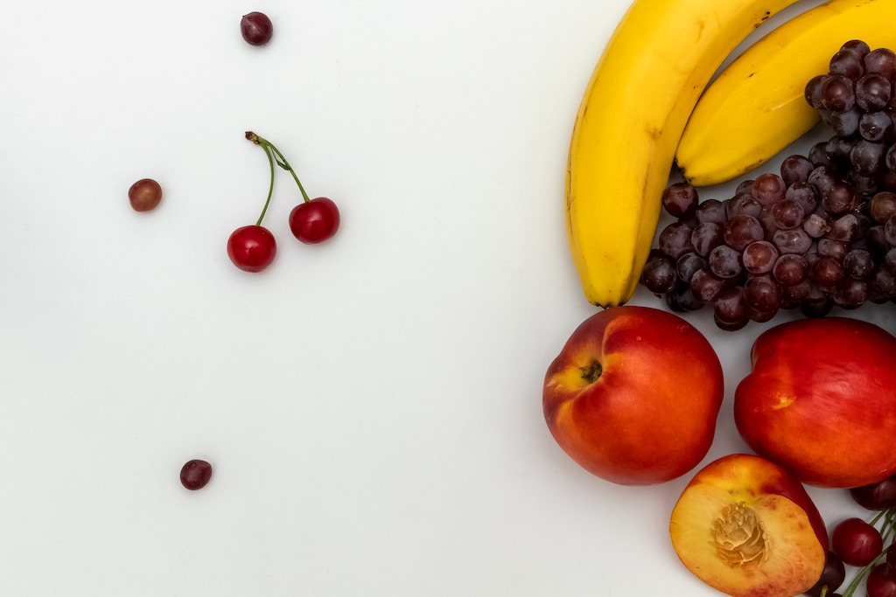
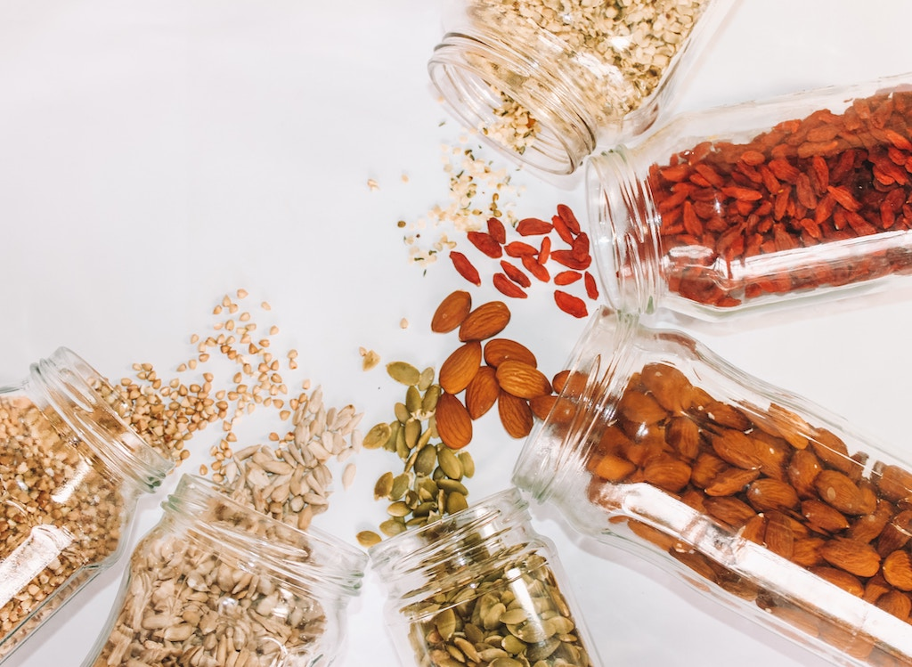
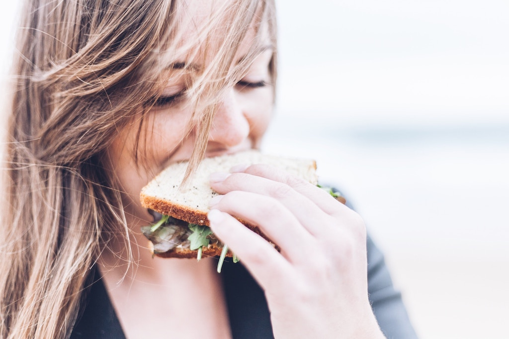
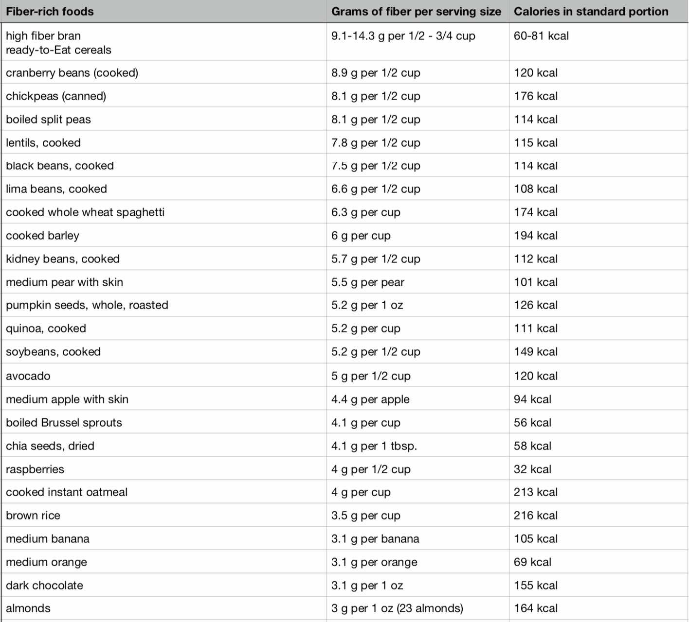
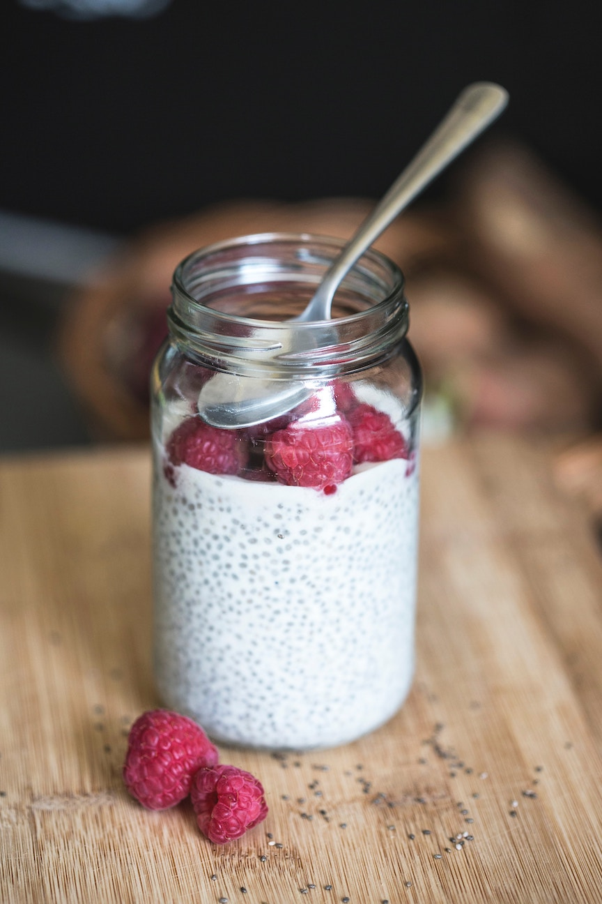
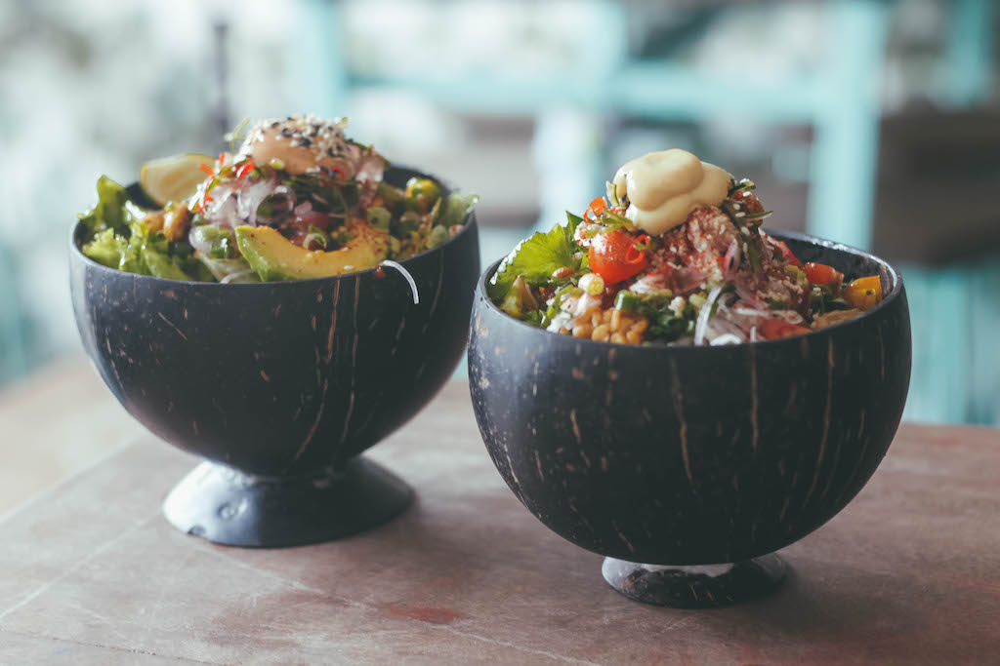

What does a healthy diet look like? These days, scientists are pretty sure about two things: First, processed, sugary foods are bad, and second, your diet should contain **lots of fiber**. 

Why is that, you’re wondering? Well, the benefits of fiber are manifold. It’s important for **digestive health** and a **regular bowel movement**, makes you feel full for longer and **improves your [blood sugar levels](https://www.iamliesa.com/blood-sugar)**. Studies now show that fiber may even help to **prevent diseases such as heart disease and diabetes**. 

Let’s have a look at what fiber is exactly, how much fiber you should eat, sources of fiber and finally at some scientific research of how it may prevent diseases.

# What is fiber?

Fiber is a **complex carbohydrate** that is found in the cell walls of all plant-based foods such as fruits, vegetables, legumes, beans or grains.

Your body usually converts carbohydrates such as starch into simple sugars for energy. However, it is **not fully able to break down fiber**. It is not until fiber reaches the large intestine, or colon, that fiber is being digested. Until then, it passes through most of our body’s digestive system undigested.

There are **three different types of fiber**, each of them having a distinct function and different health benefits. 

**1. Soluble fiber:**

Soluble fiber helps us **feel full for longer** by aiding to slow down the emptying process in our stomach. Since it’s not well absorbed, soluble fiber has a positive effect on our **blood glucose levels** as it **doesn’t contribute to blood sugar spikes**. It also helps softening the stool so it can slide through the GI tract more easily. 
Another great benefit of consuming soluble fiber is the boost of [good bacteria in the gut](https://www.iamliesa.com/inflammation-gut-health-disease), which is linked to [anti-inflammatory effects](https://www.iamliesa.com/inflammation-cause-definition-treatment-symptoms), improved immunity, and even [enhanced mood](https://onlinelibrary.wiley.com/doi/abs/10.1111/nmo.12822).
Additionally, soluble fiber helps to **lower cholesterol**, specifically your LDL cholesterol, which is associated with heart disease. Since soluble fiber is not absorbed in the intestine, it can bind cholesterol in the intestine and remove it from the body. Eating just 5 to 10 grams of soluble fiber a day can help lower your total and LDL-cholesterol by a whopping 5 to 11 points.
Soluble fiber can be found in fruits such as **apples and berries, vegetables, oats, barley and legumes**.
 
## Top 8 foods high in soluble fiber

* Whole-grain oats
* Raspberries
* Apples
* Lentils
* Oranges
* Sweet potatoes
* Barley
* Rice bran

**2. Insoluble fiber:**

Insoluble fiber is found in **seeds and skins of fruit and vegetables** (that’s why your mother always told you to eat the peel) as well as **whole-grain bread and brown rice**. 
Insoluble fiber absorbs water, which helps **softening the contents of our bowels** and it **supports regular bowel movements** by bulking up the stool. Just like soluble fiber, it also **helps to keep us full** and keep the **bowel environment healthy.**
Typical foods containing insoluble fiber are whole-grain breads and cereals, nuts, wheat bran and as mentioned already seeds and the skin of fruit and veggies. 

## Top 8 foods high in insoluble fiber

* Dried beans
* Oats
* Nuts and seeds
* Celery
* Root vegetables, such as carrots or potatoes
* Cauliflowers
* Wheat bran
* Fruit with edible seeds 

**Soluble vs. insoluble fiber:**

Every plant food has a protective cell wall. This cell wall is responsible for a foods specific shape and texture and inside of it are fiber molecules that strengthen and support growth. 
When we eat a plant food, these fibers enter our digestive system where they become **either soluble or insoluble**. Their ability to dissolve in water is the main distinction between those two types of fiber. While soluble fiber is “soluble” in water, forming a gel-like substance (think of chia pudding or porridge), insoluble fiber does not absorb or dissolve in water, passing through our digestive system, acting more like a digestive “broom”.

**3. Resistant starch:**

As the name suggests already, resistant starch is a type of starch that is “resistant” to digestion, meaning your body cannot break it down. It proceeds to the large intestine, where **good bacteria feeds on it**, producing beneficial short-chain fatty acids. 
Resistant starch  carries many benefits such as **strengthening the gut, burning fat and improved bowel health**.
Resistant starch can be found in **under ripe bananas, cooked and cooled potatoes and rice, or undercooked pasta**.

# How much fiber do I need?

By now you have probably realized that fiber is an integral part of your daily diet. Thus you might think “the more the better”, right? Well, it’s not that easy. Too much fiber can have very uncomfortable side effects, but more on that later. 
So how much fiber should you eat a day?
The [American Heart Association](https://www.empoweredtoserve.org/en) recommends a daily intake of 25 grams on a 2000-calorie diet for adults. This number varies, however, with age and sex.
Women under the age of 50 should eat **21 to 25 grams of fiber a day**, while men under 50 are recommended an intake of **30 to 38 grams a day**. Depending on a child’s age and sex, his or her intake should lie between [14 and 30.8 grams of fiber per day](https://www.niddk.nih.gov/health-information/digestive-diseases/constipation-children/eating-diet-nutrition). Women and men over the age of 50 generally need less fiber, with 21 grams for women and 30 grams for men. Is a woman pregnant or lactating, she needs at least 28 grams of fiber daily.
Unfortunately, the amount of fiber consumed by Americans is far from the recommended daily intake. According to a study, the [average American eats about 16 grams of fiber a day](https://www.ncbi.nlm.nih.gov/pubmed/22709768). Even though this data is rather old (the study was published in 2012), the trend over the years demonstrated in the study, starting in 1999, doesn’t paint a very hopeful picture.

# Symptoms of too much fiber

In all honesty, eating too much fiber is a less common problem than eating too little. Only about [5 percent of the american population meets an adequate fiber intake](https://jandonline.org/article/S2212-2672(15)01386-6/fulltext).
To keep the digestive system healthy and prevent the risk of chronic diseases a diet rich in fiber is essential. However, consuming more than 70 grams of fiber per day is associated with uncomfortable side effects. Some of these symptoms of eating too much fiber include:

* bloating
* gas
* constipation or diarrhea 
* weight gain or loss
* nausea
* stomach cramps
* feeling too full
* poor absorption of key nutrients such as calcium, magnesium, iron, and zinc

Most often, excessive fiber intake affects the digestive system as it promotes fermentation and gas formation. It also makes the bowel movements bigger and bulkier.
A [2012 study investigated the effect of reducing fiber intake](https://www.ncbi.nlm.nih.gov/pmc/articles/PMC3435786/) on 63 patients who were experiencing constipation, bloating and stomach cramps. Patients who stopped or reduced their intake of dietary fiber showed significant improvement in their symptoms (more frequent bowel movement, less bloating, and less abdominal pain), while those who continued on a high fiber diet didn’t show any changes. 

# How to increase your fiber intake

Eating high-fiber foods is the best way to up your fiber intake while not consuming too many calories. Fiber can be found in most vegetables, fruits, and plant-based foods. Here is a list of high-fiber foods to try:

You can also boost your fiber intake with some simple tricks:

* add a sprinkle of bran or psyllium husk or chia seeds on cereals, muesli, yogurt, or smoothie
* add a small handful of seeds and nuts as a snack
* add legumes to your meals
* leave the skin on the fruits you’re eating
* go for whole grain varieties instead of white rice, bread or regular pasta

# Scientific research on how fiber may prevent disease

Hypertension and Type 2 Diabetes are huge risk factors for future cardiovascular disease. The diet, too, can have a major impact on cardiovascular health. A team of researchers from Care Well Heart and Super Specialty Hospital in Amritsar, India, studied the relation between a high fiber intake and its impact on cardiovascular disease risk factors.

The study examined 200 individuals suffering from Type 2 Diabetes over a period of six months. The participants received behavioral and nutritional counselling, including recommendations for increasing the consumption of high fiber vegetables, fruits, cereals and legumes, elevating the fiber intake up to 20 to 25 percent from the recommended allowance (20 to 24 grams a day).

The participant’s fiber intake was controlled by the researchers in several ways, including having the participants send them pictures of their meals via WhatsApp. Like this, they did not only get a clearer picture of the fiber intake, but also of the meal portion size. Researchers and participants also talked on the phone three times a week, during which detailed dietary recall was taken.

Those participants on a high fiber diet experienced [significant improvement in several cardiovascular risk factors](https://www.acc.org/~/media/Non-Clinical/Files-PDFs-Excel-MS-Word-etc/Meetings/2019/Course%20PDFs/Middle-East-Abstracts/P528%20Kapoor.pdf). Serum cholesterol was reduced by 9 percent, triglycerides by 23 percent, systolic blood pressure by 15 percent and the fasting glucose by 28 percent. Therefore it is the researchers opinion that a high fiber diet is inversely related with cardiovascular risk factors and may be able to protect against cardiovascular disease. 

# High fiber diet

As fiber is only found in plant-based food, a high fiber diet should limit the intake of meat and focus on vegetables, fruits, nuts and seeds, legumes and whole grains. Like this, the diet promotes healthier eating patterns overall. Additionally, foods high in fiber will keep you full longer as they need longer to chew on and longer to be digested. 

If you’re just starting out to up your fiber intake, make sure to do so gradually, as too much too quickly can upset your stomach. Also, make sure to drink more water when increasing your fiber intake, otherwise intestinal blockage may appear. 

When opting for a high fiber diet, it is important to choose a variety of fiber-rich fruits, veggies, legumes, seed and nuts to get all the benefits. Even though a banana may be high in fiber, it shouldn’t be the only fruit you’re consuming as you will miss out on key nutrients. Variety is essential. So here is a small list of the high fiber top players in each category that you should combine for health benefits. 

**High fiber fruits:**

* Bananas
* Oranges
* Apples
* Berries such as raspberries, strawberries, blueberries
* Pears

**High fiber vegetables:**

* Brussel sprouts
* Broccoli
* Carrots, celery roots, beets
* Collard greens, kale
* Artichokes

**High fiber legumes:**

* Navy beans
* Split peas
* Lentils
* Black beans
* Lima beans
* Kidney beans

**High fiber grains:**

* Barley, quinoa, bulgur
* Whole wheat spaghetti
* Wheat bran cereal
* Whole grain bread

**High fiber nuts and seeds:**

* Almonds
* Pumpkin seeds
* Sunflower seeds
* Chia seeds
* Pistachios

# One day high fiber meal plan

Here’s what an ideal day on a high fiber diet could look like. According to the Academy of Nutrition and Dietetics, high fiber food means it contains at least 5 grams of fiber or more. Feel free to swap and add ingredients according to preferences and needs, as long as they contain a similar amount of fiber.

**High fiber breakfast’**

Start your mornings right with a boost of fiber, so you stay satiated until lunchtime. 

*Chia Seed breakfast bowl:*

Ingredients:
* ¼ cup chia seeds
* 1.5 - 2 cups almond milk
* 2 tbsp. pure maple syrup
* ½ medium banana
* handful raspberries
* handful strawberries
* 1 tbsp. almonds

Instruction:
Mix chia seeds, milk and maple syrup in a bowl, whisk well to prevent clumping. Store in an airtight jar and refrigerate overnight. Serve with fruits and almonds as topping. 

**High fiber lunch**

Incorporating fiber into your lunch meal can help you prevent an afternoon craving as well as the typical after lunch slump.

*Broccoli brussel sprouts salad*

Ingredients:
* 1 broccoli
* 6 brussel sprouts
* 5 medium tomatoes
* 1 tbsp. sunflower seeds
* 1 avocado
* ½ mozzarella
* 2 spring onions
* 3 tbsp. olive oil
* 1 tbsp. white balsamic vinegar 
* salt and pepper

Instruction:
Wash the broccoli and brussel sprouts and cook for about 6 minutes. Cut in small florets and let them cool off. Meanwhile cut the spring onions, tomatoes, avocado and mozzarella, add the sunflower seeds and put in a bowl. Add broccoli and brussel sprouts when cooled down. For the dressing, add the olive oil and balsamic vinegar and season with salt and pepper. 

**High fiber dinner**

Finish your day with a plate of vegetables, legumes, and grains for the full fiber impact. 

*Whole-grain veggie burrito bowl*

Ingredients:
* 1 bag boil-in brown rice
* 2 tbsp. olive oil, divided
* 1 teaspoon ground cumin
* 3 garlic cloves, minced
* ¾ teaspoon salt, divided
* 1 can unsalted black beans, undrained
* 1 tbsp. chopped chipotle chiles, canned in adobo sauce
* 1 cup chopped cherry tomatoes
* ⅓ cup finely chopped onion
* ¼ cup chopped fresh cilantro
* 1.5 tbsp. fresh lime juice, divided
* 1 jalapeno pepper, seeded and finely chopped
* 1 ⅓ thinly sliced red cabbage
* ¾ cup feta, crumbled
* 1 ripe avocado, peeled and sliced

Instruction:

Cook rice according to package directions. Heat a medium skillet over medium heat, then add 1.5 tbsp. olive oil to the pan. Add cumin and garlic and cook for 1.5 minutes, stirring frequently to prevent overheating. Stir in the rice and ¼ teaspoon salt.

Next, partially drain the black beans and place them and the remaining liquid in a small saucepan. Stir in the chipotle chiles and ¼ teaspoon salt. Then, bring the mixture to boil. Reduce the heat and keep at a simmer for 5 minutes.

Combine the remaining ¼ teaspoon salt, tomatoes, onion, cilantro, 1 tbsp. lime juice, and jalapenos.  

Combine the remaining 1.5 teaspoons oil, 1.5 teaspoon juice, and cabbage; toss well.

From the rice, you can make 4 portions in a shallow bowl. Divide the bean, tomato and cabbage mixture over the rice and add cheese and avocado evenly.

<NotADoctor />
