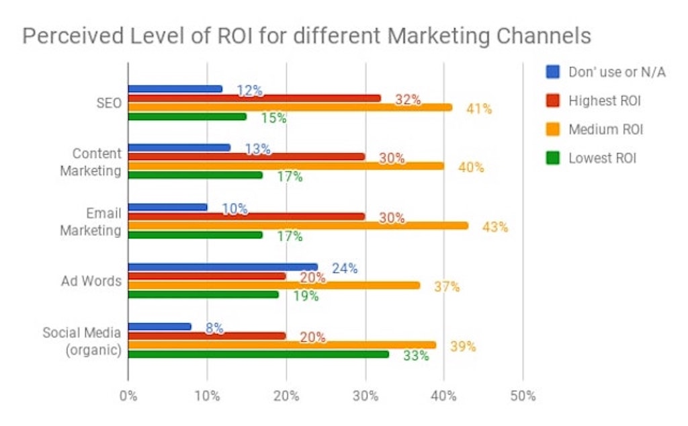

Engagement on your blog proves to new readers that your content is worth reading, plus it also gives you the perfect opportunity to get in contact with your audience and show them that you care. In the long run, invested visitors mean $$ in the bank as they are more likely to buy from you than those who don't know you at all.

On the other hand, a blog that looks like a ghost town will give new visitors the impression that there's nothing worth sticking around for. Hence, your goal with every blog post should be to promote engagement.

But how do you actually get your readers to engage? How can you increase comments, social shares, and links?

That's what I want to cover in this article.

<Title id="what-is-engagement">What is Engagement?</Title>

When thinking about the word *engagement*, the first thing that might come to mind is reader comments. While there are (and there should be) many more ways for your reader to actively interact with your content. This reader engagement doesn't always have to be visible on your blog like as a comment is, though it certainly helps to build up authority. Here are three ways your audience might interact with you on your blog:

**Social Sharing**

One way for your audience to engage with your content is to share it on their social media channels. If your content is exciting enough that people want to share it with their friends, that's a huge win for your blog, increasing your visibility on social media and bringing more traffic to your page.
To make sharing convenient for your readers, it's critical to implement the latest sharing buttons on your blog's sidebar. Right now, most blogs include sharing buttons to Twitter, Pinterest, and Facebook, but some other popular sharing sites are WhatsApp, LinkedIn, Reddit, and HackerNews. And of course, make sure there's a link to your email..

**Comment Sections**

Comments are probably the most obvious way your visitors can interact with your blog. They are a great indicator for your to see if your audience cares about what you have to say. If your readers care enough to leave a comment on your post, that means they're more likely going to  come back for more of your content. In the long run, the more engaged your audience is, the more likely they are to make a purchase on the website..

**Mailing Lists**

Getting on your mailing list is the coronation of your content marketing efforts. Nothing is as powerful as your mailing list. Social media platforms may change, but email has stood the test of time. If you can get your visitors to subscribe to your blog, that gives you a better way to communicate with them. It's very effective in reaching your audience — it's actually <BlogLink to="https://www.dreamgrow.com/11-reasons-why-newsletter-beats-social-media/">at least four times more effective in reaching them than Facebook</BlogLink>, and people are much more likely to buy from you.

<Title id="boost-blog-engagement">How to boost your Blog Engagement</Title>

**Know Your Audience**

The first and most important step not only in your content strategy, but also to acquire more  engagement on your blog, is to know your audience. They are the foundation of your blog.

You want to understand exactly who they are, what they want, and what they need help with. In the end, the only way you can provide your readers with content they actually care about is if you know them and their likings.

Knowing things like your audience's gender, age, interests, education level, and their language  not only helps you  create relevant content; it also helps you in creating a link between you and your readers. You can make a personal connection with them and align your message with your audience's interests and beliefs. That way, they will feel valued and understood.

**Create Content Worth Sharing**

I am sure you're trying to give your best with every blog post you're creating. But sometimes we struggle to find the time  to give it the fine tuning it needs to be exceptional.

So how do you actually create content that is so good that people just have to share it with the world?

I'm sure you can guess the answer: You need to invest a lot of  time into crafting high quality blog posts. If you do so, the benefits will be exponential. As I discussed before, great content doesn't only get more shares, it can also generate more traffic for your website.

One way to quickly increase the overall value of your content is to focus on so-called “pillar posts” (the posts that form the foundation of your blog). Approach  pillar posts by covering important topics in greater depth than your competition. Try to go for at least 1000 words — the more the better. But as always, make it relevant.

Unique images are also a great way to make your content pop more. Whenever possible, you should add pictures to your posts.

Another great way to give your content a touch of authority is by adding interesting statistics.

**Craft your Headlines**

Headlines can make or break your content's success. It's the first thing a visitor reads and it establishes curiosity and interest (or not).

However, always remember that a headline is a promise. The web is full of clickbait headlines that leave readers disappointed and dissatisfied with the content they invested their valuable time in. Don't walk into that trap; deliver on your promise.

If you don't, your visitors will leave you quickly and never come back, as they know they won't find answers on your blog. It's just not a good first impression to break a promise.

However, a great headline in combination with content that delivers, is something people love to share on social media which will give your content more reach and thus more traffic.

**Add Valuable Data**

I already nibbled on this idea when talking about outstanding content that people will want to share, but it's worth an extra mentioning.

Adding relevant data to your content establishes trust in your audience and gives you the credibility as an expert in your field.

When readers trust a source, they are much more likely to share content. Thus, add data whenever possible to build confidence in your message.

Give your site the credibility it needs to be seen as an authoritative blog that is worth linking to when quoting and sharing content from.

**Include Something Unique To Your Content**

If you want to write about Facebook, nutrition, or yoga - whatever it may be - you may find that most of the obvious topics have already been covered a hundred times.

So why would you cover it again? And why would a reader care?

Because you include something to your content that makes you stand out. Something that others haven't already posted.

Take a look at other posts about your particular niche. Maybe you can add that awesome infographic that nobody has included yet. Or maybe you find that nobody shares that one fascinating piece of information about Facebook that you have.

Try to stand out. Try to find that one element that others don't have.

Once you've found it, make sure to include it in your post. With this tactic you will boost your shares, links, and comments because it's actually something valuable and new for your audience.

**Ask Questions and Create a Call to Action**

Sometimes this is the easiest way to boost engagement on your blog. We often shy away from actually asking what we want from our audience because we don't want to come across as too bold. However, most of the time, our audience actually doesn't mind. They are happy to help if they like the content.

Thus, ask a question you want your audience to comment on or ask them to share your content with their friends. You will be surprised how many people actually do this if you just ask nicely.

As I mentioned already, make sure it's easy for your readers to then share your content. Make your sharing buttons bold and visible so that they only have to click once to share your fabulous content.

**Respond to Comments**

A blog is not a one-way street. A discussion that stems from great content is sometimes the most precious thing that can happen to your work. It gives you valuable insights into your audience's beliefs and interests —and  information you can use for your next posts.

That being said, it is always important to reply to your reader's comments. It helps you establish a deeper and more meaningful connection with them and will show them that you care about what they have to say.

**Show Your Numbers**

Have you ever heard the phrase, “it only takes one spark to light a fire”? This one holds so true for engagement as well.

When people see that somebody has already left a comment on your blog, they are much more likely to write a comment as well. Hence, maybe you want to ask a friend or a fellow blogger to make that first move and start a discussion. Most likely, other people will follow.

It's the same with your social shares. The more shares your content has, the more likely people are to share it as well because those numbers establish trust in your expertise. Therefore, feature your social share numbers prominently.

<Title id="conclusion">Conclusion</Title>

There are many ways for you to promote engagement on your blog. However, boosting engagement takes time. You may not see an increase right away, but once you've built a loyal audience by creating valuable, relevant content, the engagement will follow.

And of course, all these tips are under the premise that your blog already has a good amount of readers. So getting an audience really is the first step to build a loyal following, and in the end to get engagement on your blog.

Did you find this blog post helpful? If so, please share it with your peers :)

