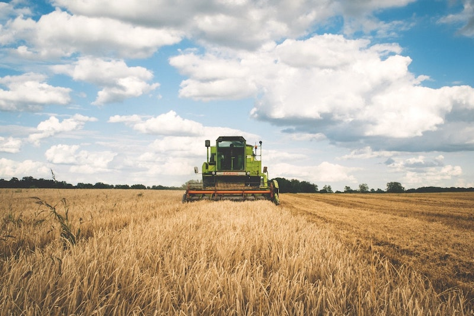
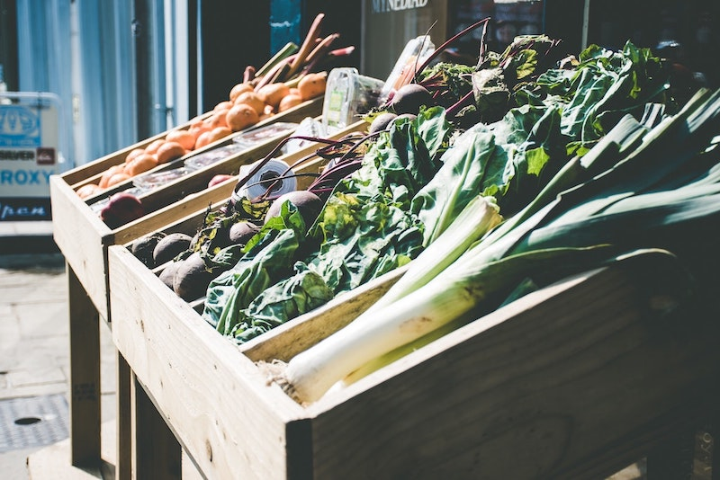
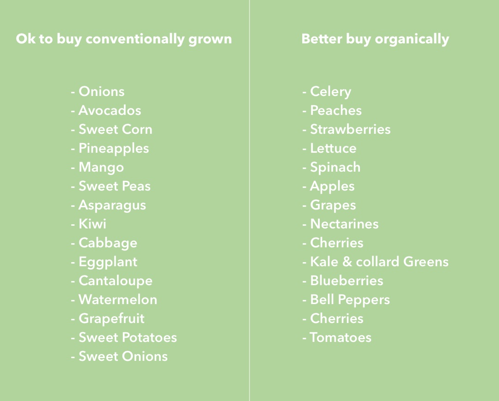

import YouTube from 'react-youtube';
import BlogLink from '$components/Link';
import { Title, Subtitle, Divider } from '$components/mdx';

Stocking a healthy kitchen is actually not that difficult. There is only one rule to follow when it comes to fruits and veggies: Buy fresh, local, organic, and in-season produce. These non-starchy carbohydrates contain tons of minerals, vitamins, and fiber, that keep us healthy and boost our biological processes. The question of when, where, and how your food is grown is essential to know in order to only purchase the cleanest and most nutrient-dense produce. In this article you will learn what’s important when it comes to buying fruits and veggies in order to get the highest amount of nutrients possible.

<Title id="healthy-kitchen-buy-in-season">Buy in-season when possible</Title>

Buying in-season helps to ensure that you buy the **freshest and the most nutrient-dense food**. Seasonal food is produce that is purchased and consumed at around the same time when it is harvested. It is a specific time when a produce is picked in your geographical region and sold to the market.

Of course, these times vary for different produce. Different crops need different conditions to grow. Some grow better over the winter, some better over summer. Also the weather and growing conditions play a major role. They may bring some variation to the harvest time, but usually the harvest for specific produce is around the same time each year.

<Title id="healthy-kitchen-local-food">Buy food that is grown locally</Title>

Our **bodies are designed to eat fruits and vegetables in season**. After all, there were no supermarkets and no ex- and imports back in the days. Eating in-season foods has another advantage to it: It helps you to eat more food that is grown locally. That is not only very important from a nutritional standpoint, but also from an environmental one.

These days, foods can be shipped easily. Increasingly efficient global transport networks make it easy for you to eat your exotic fruits grown in Asia in the US or anywhere else in the world. But on what costs? **The farther the food has to travel, the greater the impact on the environment due to pollution from carbon dioxide emissions, generated by the transporting vehicles.**

The traveling time also affects the nutrient value. This is due to a process called **respiration**. When plants are picked, they are in fact not dead. However, exactly because of this fact they start to **lose nutrients**. After the harvest, they still continue to breathe. This is what’s called respiration. This process breaks down stored organic materials, such as proteins, carbohydrates and fats which then leads not only to a loss of flavor but also of nutrients. From this respiration, produce loses heat as well as moisture, which is just one way how valuable nutrients are lost. When they are stored in a warm, dry air can, this process speeds up even more.

The respiration time of produce vary, e.g. broccoli, peas, mushrooms, sweet corn and asparagus have a very high respiration rate which makes them lose nutrition and flavor more quickly than e.g. garlic, apples or onions which have low respiration rates. **The longer produce has to breathe before it’s consumed, thus, the longer it has to travel to get to you, the more nutrients it loses.** For example: Just one week post-harvest, the amount of Vitamin C in broccoli was almost undetectable. Stress of travel, fluctuation in temperature and rough handling can even exacerbate this process. That means, that less transit time will ensure that you’ll get the highest amount of nutrients out of your food. Thus, local food that you can eat right after harvest is the healthiest choice. Plus, locally grown products tend to be more seasonal.

<Title id="healthy-kitchen-organic-food">Try to buy organic food</Title>

The best place to buy in-season is the **local farmers market**. However, local doesn’t always mean that the produce was grown with organic methods. To make sure it is, just ask your local farmer about his growing methods.

In a green kitchen, food should be **organic and non-GMO**. Organic means that it is grown on farms committed to sustainable and environmentally friendly agricultural methods. These farms need to be **certified and meet strict standards about how fruits and vegetables are grown**. This affects e.g. the permissible levels of pesticides, chemical fertilizers and other synthetic additives or the use of industrial solvents and irradiation. Those are all substances that people don’t want in their food plus the can pollute the environment through water and soil contamination.

<Title id="healthy-kitchen-no-GMO">Be mindful of GMO</Title>

Another thing to be mindful about is the **use of GMO** (genetically modified organisms). The traditional crop growing has been done for centuries. However, in the last decades we have started to alter the genetic makeup of plants and have genetically engineered them for specific purposes. This creates plants, bacteria, animals and virus genes that don’t occur in nature this way.

GMO is presumed to be connected to **health problems, environmental damage and violation of farmers’ and consumers’ rights**. Crops like corn, soy or cotton are often genetically modified and often packaged foods are derived from them.

<Title id="healthy-kitchen-organic-food-choice">It’s your own choice to buy organic food</Title>

Buying organically is a personal decision but many find that it just tastes better and they are happy for the restriction in potentially harmful additives.

Due to the way they’re grown, there are certain fruits and veggies that are more likely to contain residue from pesticides. In this list by the Environmental Working Group (EWG), you’ll get some assistance in what to better buy organic and what is ok conventionally grown.

<Title id="healthy-kitchen-conclusion">Conclusion</Title>

Of course, everybody knows that fruits and vegetables are a part of a healthy kitchen. However, the way fruits and veggies are grown, whether they are imported or not, and the time of buying them plays an important role in a food's nutrient-density.

When buying fruits and vegetables, try to buy in-season, local, and organic food that is not genetically modified. If you follow these rules, you will make sure that your food contains the highest amount of nutrients possible.

