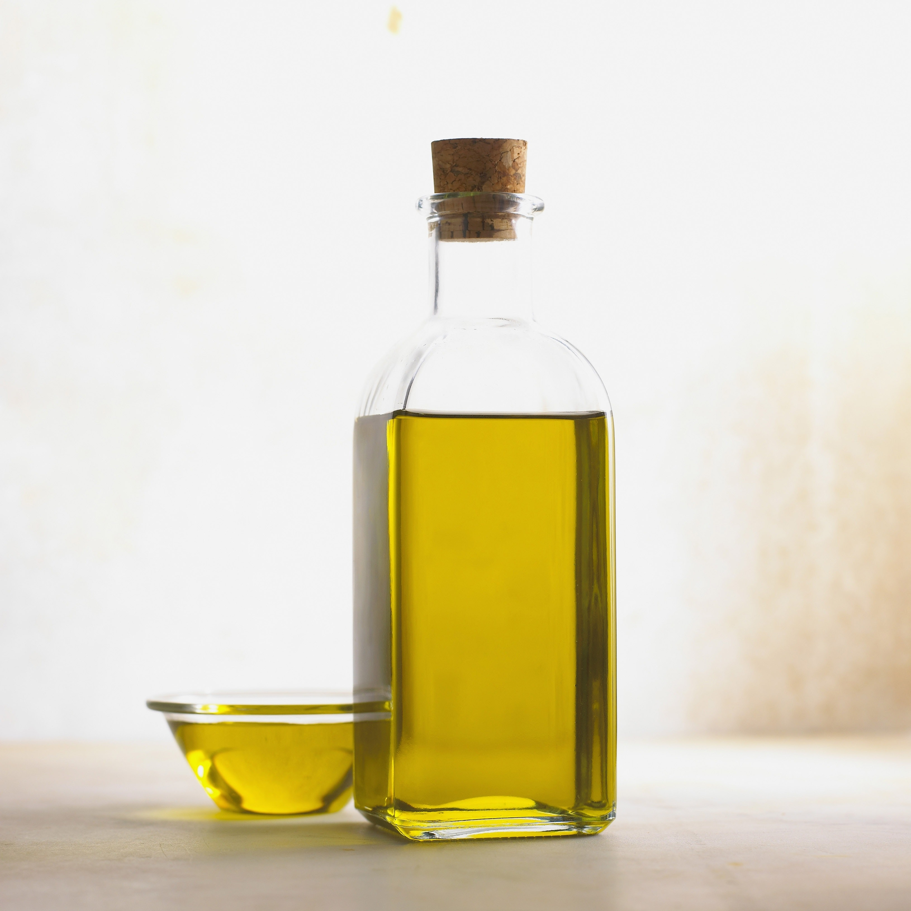
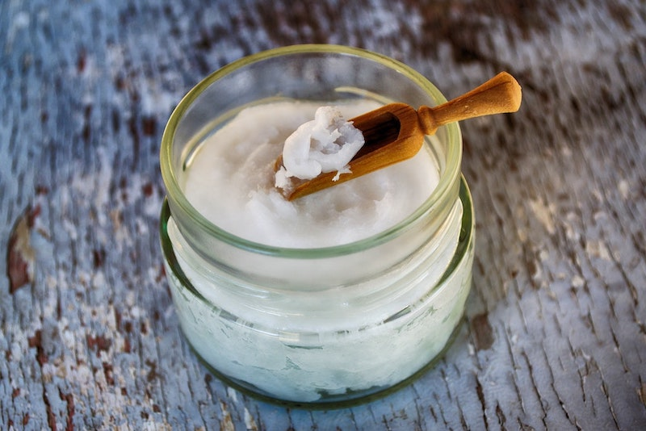
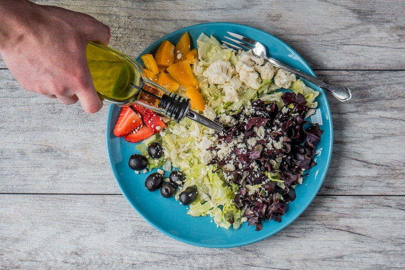
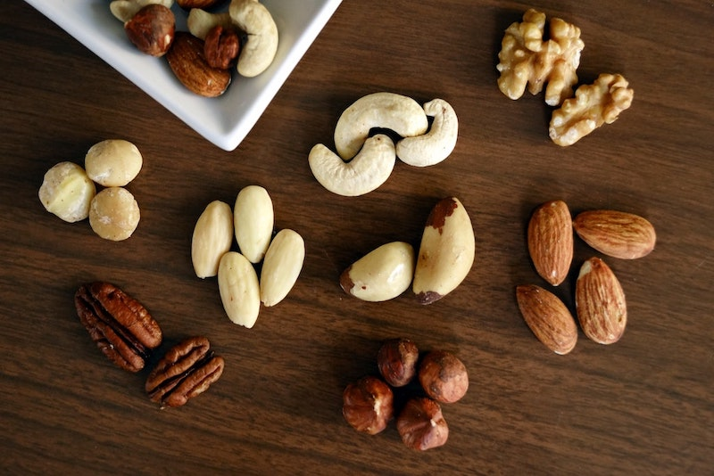
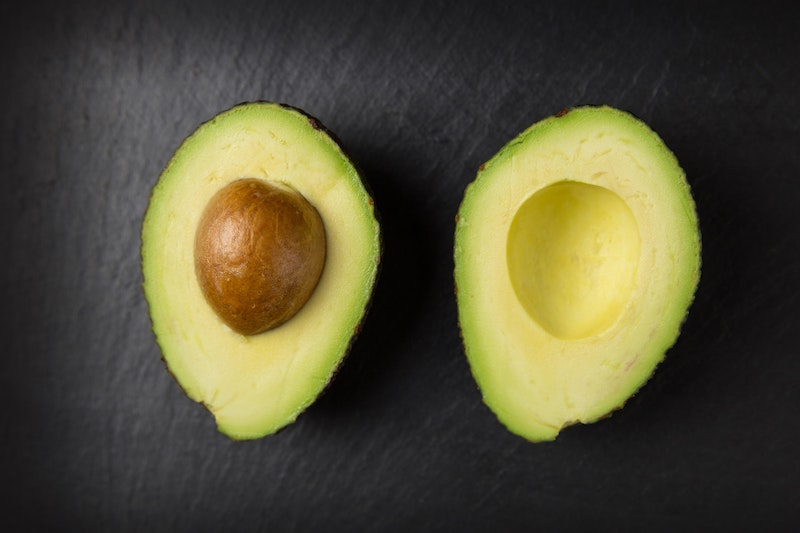
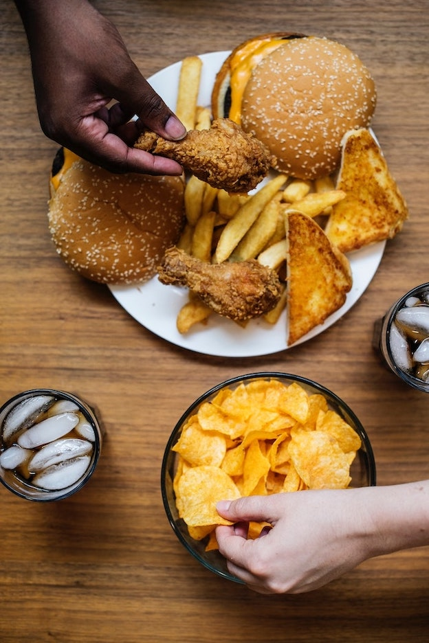

import YouTube from 'react-youtube';
import BlogLink from '$components/Link';
import { Title, Subtitle, Divider } from '$components/mdx';

Shelves in supermarkets are full of low fat products and the industry has long been trying to convince us that fat is the enemy to a slim figure. As a result, people started to eat more sugar, refined carbs and processed foods instead, causing our society to become fatter and sicker. 

However, times have changed and studies show that **fat is indeed not the devil we believed it to be**. Quite the contrary: **Fat should be part of a healthy kitchen** and there are healthy fats, too. It’s simply about the kind of fat that we are putting into our bodies that we should pay attention to. (<BlogLink to="http://annals.org/aim/article-abstract/1846638/association-dietary-circulating-supplement-fatty-acids-coronary-risk-systematic-review">1</BlogLink>, <BlogLink to="https://www.ncbi.nlm.nih.gov/pubmed/20071648">2</BlogLink>)

Fat is an important macronutrient. It helps the **brain to function properly**, it plays an important part in our **hormone production, helps to absorb certain vitamins and minerals, and helps protect our immune system**. 

Fat also **slows down your digestion**. Less than ten percent of the fat you’re consuming turns into sugar. Healthy fats slow down how your body absorbs glucose into the bloodstream. Slowing down this process, the blood sugar curve is lengthened, preventing our blood sugar to rise high and then crash down. This keeps our stomach full and satisfied longer and we are less likely to experience the famous afternoon slump after our meal. 

So, if fat isn’t the devil and we should actually add it into our healthy diet, what’s important to know when it comes to healthy fat, what should we pay attention to?

<Title id="healthy-kitchen-oil">Healthy cooking Oil - a staple in the kitchen</Title>

Let’s start to take a closer look at cooking oil, because after all we use it all the time for cooking, sauteing, roasting, frying or as a delicious salad dressing.

One of the most important things to pay attention to when it comes to cooking with oil is the different **smoke points**. 

<Subtitle id="healthy-oil-smoke-point">Pay attention to the smoke point</Subtitle>

The smoke point, also known as the burning point of an oil or fat,  is the temperature at which an oil begins to smoke. This temperature is different for each oil and it is important to know the different oils’ smoke points as heating beyond that point causes oil to oxidize or chemically react with oxygen. The consequence is the **release of harmful free radicals and other compounds**. 

So, the lesson here is: **Don’t heat above the smoke point!**

It’s not only heat that causes oil to oxidize. Also light and air are among a healthy oil’s enemy. That’s why the storage of oil is essential to actually keep it healthy. 

Oil should be stored in **cool, dark places** and not just in the short term but throughout its life. That includes the transportation, the storage, the marketing and finally - your home. 

When purchasing oil, look for **dark glass bottles** and always **screw the lid tightly** after using it. 

<Subtitle id="saturated-unsaturated-fat">Saturated and unsaturated fats</Subtitle>

According to the American Heart Association, **between 25 and 35 percent of your total daily caloric intake should consist of fat**. Most of this intake should be from **unsaturated fat**. 

The chemical structure of saturated fat is made of single bonds that are resistant to heat and less reactive. Because fatty acids are packed tightly together the higher the saturated fat in an oil, the higher the smoke point, and the more stable an oil is. Saturated fat tends to be solid at room temperature (e.g. butter).

Oils with more unsaturated fat however are made of double bonds which makes them less stable. They have a **lower smoke point** and are thus sensitive to heat.

Unsaturated fat can be further categorized as monounsaturated fat and polyunsaturated fat. 

Monounsaturated fats only contain one double bond in their chemical structure. Typically, they are **liquid at room temperature**. They include canola oil or olive oil.

Polyunsaturated fats consist of two or more double bonds in their chemical structure and they are liquid at room temperature, too and include sunflower oil and corn oil.

In food, healthy unsaturated fats can be found in nuts, olives, avocados and fatty fish. 

Generally speaking, **for cooking, oils with more saturated fats are preferable as they are more stable and have a higher smoke point**.

<Title id="cooking-oil">Cooking oils: Options to buy</Title>

There are several options to buy when shopping for cooking oil. As already explained, things to look out for are the smoke point and the proportion of saturated vs. unsaturated fat. Here are some good options when purchasing cooking oil:

**Coconut oil** consists to 90 percent of saturated fat, making it very stable. The average smoke point of 350 to 365 degrees makes it suitable for most mid-temperature cooking. 

Coconut oil contains a fat source called medium chain triglycerides (MCTs). They are known to provide you with quick energy and a sharper brain as they are absorbed more quickly than other fats and easily converted into energy. 
Another benefit is its antibacterial and antiviral properties which may help balance your gut flora and support your immune system. MCT is also easier to digest than most other fats.

Another benefit of coconut oil is the lauric acid, a fatty acid that can improve cholesterol and kill pathogens and bacteria. 

**Ghee** is a type of fat made by heating butter. It is similar to clarified butter, meaning the milk solids like lactose, whey and casein have been removed. What’s left is just the fat. 

Ghees benefits range from building stronger bones to enhancing weight loss. It’s also said to improve digestion and relieve inflammation. 

Also, ghee is full of fat-soluble vitamins such as A, E and K2, which are important for maintaining a healthy vision, maintaining the natural glow of your skin and much more. It also contains many healthy fatty acids including CLA, which can help <BlogLink to="https://www.ncbi.nlm.nih.gov/pubmed/15159244">reduce body fat</BlogLink>  (conjugated linoleic acid. Studies also found that it might be effective in <BlogLink to="https://www.ncbi.nlm.nih.gov/pubmed/15941017">preventing cancer information</BlogLink>, alleviating <BlogLink to="https://www.ncbi.nlm.nih.gov/pubmed/16440602">inflammation</BlogLink> and lowering blood pressure. 

In addition to CLA, ghee is also full of butyrate, which is a short-chain fatty acid that is important for our gut health. Studies indicate that butyrate may help support <BlogLink to="https://www.ncbi.nlm.nih.gov/pmc/articles/PMC2699871/">healthy insulin levels</BlogLink> and <BlogLink to="https://www.ncbi.nlm.nih.gov/pmc/articles/PMC4816278/">fight inflammation</BlogLink>. It also plays an essential part in promoting a healthy <BlogLink to="https://www.iamliesa.com/achieving-hormonal-balance">gut microbiome</BlogLink>, which is super important for our overall health. 

Another benefit of ghee is its high smoke point as it is high in saturated fat. With 485 °F it is suitable for baking, sautéing and roasting without the risk of destroying its important nutrients.

**Avocado oil** is quickly gaining popularity for its versatility and health benefits. It is loved for its mild flavor and its neutral odor.

While most oils are being extracted from the seed of the plant, avocado oil is extracted from the flesh of the avocado itself. 

Avocado oil has one of the highest smoke points of 520 °F which makes it ideal for high-heat cooking. At the same time, it also makes for a delicious salad dressing. It is also rich in vitamins A, E and D and contains a good amount of magnesium and antioxidants. 

The amount of monounsaturated fats is a little higher in avocado oil, which makes it a little less stable but at the same time, these fats help your body to absorb nutrients and vitamins better. The most common type of monounsaturated fat which is also found in avocado oil is oleic acid. Studies show that oleic acid may <BlogLink to="https://www.ncbi.nlm.nih.gov/pubmed/23165533">reduce inflammation</BlogLink> and even reduce the risk of certain cancers. 

While **algae oil** may not sound super delicious, it is a very healthy choice for cooking, baking and dressing with a high smoke point of 480 °F. 

Just like avocado oil, it is higher in monounsaturated fat, which makes it less stable, and is high in DHA (docosahexaenoic acid), an omega-3-fatty acid that our bodies need for mental and physical health. Studies have shown that DHA from algae oil <BlogLink to="https://www.ncbi.nlm.nih.gov/pubmed/22113870">reduces serum triglycerides and increases HDL cholesterol (the good cholesterol) and LDL cholesterol </BlogLink> in persons without heart diseases. 
Apart from Algae oil offering an excellent fatty acids profile, it’s also popular for its neutral taste to it that doesn’t overpower food flavor.

**Olive oil** is probably the most famous among the healthy oils. It consists of close to 75 percent monounsaturated fats such as oleic acid, which makes it very heat-stable, and is known for its heart healthy effects. 

Oleic acid is connected to reducing <BlogLink to="https://www.ncbi.nlm.nih.gov/pubmed/16484595">inflammation</BlogLink> and it may even have beneficial effects on genes that are linked to cancer (<BlogLink to="https://www.ncbi.nlm.nih.gov/pubmed/15642702">1</BlogLink>, <BlogLink to="https://www.ncbi.nlm.nih.gov/pubmed/17168666">2</BlogLink>).

Olive oils also contain a great amount of antioxidants that may reduce the risk of chronic diseases. They also fight off inflammation and help protect the cholesterol in that it raises good cholesterol (HDL) and lowers oxidized bad cholesterol. (<BlogLink to="https://www.ncbi.nlm.nih.gov/pubmed/19079898">1</BlogLink>, <BlogLink to="https://www.ncbi.nlm.nih.gov/pubmed/12550060">2</BlogLink>)

Apart from beneficial fatty acids and antioxidants, olive oil also contains a modest amount of vitamins E and K.

To get the greatest amount of nutrients, buying the right olive oil is important. Extra virgin olive oil (EVOO) is considered to be especially healthy as it retains some of the antioxidants found in olives. But be careful, there is a lot of fraud on the olive oil market and “extra virgin” may in fact not always be what you get. Thus it’s very important that you read the label carefully. 

Olive oil has a smoke point range of 325 to 375 °F. If you opt for refined olive oil, the smoke point is with 425 °F even a little higher.

<Title id="cooking-oil-avoid">Cooking oils to avoid</Title>

By now it should be obvious that the oils we store in our kitchen aren’t all the same and we cannot condemn all the fats out there. Some are in fact beneficial for us, but some on the other hand should be avoided. These include:

* canola oil
* sunflower oil
* soybean oil
* grape seed oil
* safflower oil
* cottonseed oil
* vegetable oil
* corn oil

These oils are **manufactured through heavy chemical extraction processes** such as deodorizing, bleaching and other use of toxic solvent. 

They also contain a **heavy amount of Omega-6 fatty acids** which are said to cause **inflammation**.

<Subtitle id="omega-3-omega-6">Omega-3 vs. Omega-6 fatty acids</Subtitle>

The human brain is almost **60 percent fat**. For that reason alone, abandoning fats from our diet is a terrible idea. In order for the brain to function properly, Eicosapentaenoic acid (EPA) and Docosahexaenoic acid (DHA), forms of omega-3 fatty acids, are especially important as they build cell membranes and promote new cell information. 

Both, Omega-3 and Omega-6 fatty acids are **polyunsaturated fats that your body cannot produce itself**, thus you **have to get them from your diet**. Omega-3 as well as Omega-6 is essential for your body, meaning that your body needs them both. However, the **proper ratio** is important. 

Information suggest that our ancestors lived on a diet that had a <BlogLink to="https://www.ncbi.nlm.nih.gov/pubmed/21279554">ratio of omega-3 and omega-6 fatty acids of about 1:1</BlogLink>. However, today the ratio is about 1:10 to 1:20-25 meaning that we are **heavily Omega-3 deficient**. Our diet mostly consists of Omega-6 fatty acids but why does that matter if our body needs both? 

The problem with Omega-3 and Omega-6 fatty acids is that they have opposing roles in the body. While **Omega-3 is generally anti-inflammatory, Omega-6 fatty acids promote inflammation**. 

This is particularly dangerous in the brain. If inflammation gets chronic, this can affect all sorts of processes which will eventually not only affect the health of your brain, but of your whole body. 

But let’s not condemn Omega-6 fatty acids all together. As I said, the body needs Omega-3 as well as Omega-6.

Omega-6 fatty acids are linked to several <BlogLink to="https://www.brainmdhealth.com/blog/know-fatty-acids-omega-3-omega-6/">benefits</BlogLink> such as raising the good cholesterol (HDL) and lessening the risk of diabetic neuropathy, rheumatoid arthritis and allergies. Furthermore, inflammation is not always the bad guy. In fact, it is vital for the body as it protects it from infection and injury. 

Omega-6 fatty acids are commonly found in our western diet as they can be found in high concentration in popular foods such as:

* vegetable oil
* fast food
* chicken, pork, beef
* dairy products
* eggs

Omega-3 fatty acids most commonly occur in fatty fish, algae and several high-fat plant foods such as:

* mackerel and salmon
* sardines
* anchovies
* flaxseeds
* chia seeds
* walnuts
* soybeans

<Title id="healthy-oils-salad">Healthy Oils for your salad</Title>

There are several healthy oils that are comprised of polyunsaturated fats. These may be used occasionally as a dressing or finishing oil, as they oxidize more easily. These oils include: 

* almond oil
* walnut oil
* flaxseed oil

You’ll always want to buy these oils as “cold pressed”. That’s because in order to limit oxidation during the production, the heat was minimized.

<Title id="whole-food-fats">Stocking whole food fats</Title>

Even though many people might be wary of eating too many carbs, stocking nuts as a healthy snack is a good idea. They are rich in healthy fats and contain proteins as well. 

Furthermore, they are a great source for many nutrients and loaded with antioxidants that help control free radicals. They also have a beneficial effect on cholesterol and triglyceride levels.

When purchasing nuts, try to go raw and organic. Here is a list of a healthy collection:

* almonds
* cashews
* pecans
* walnuts
* pistachios
* macadamia

Store your nuts in an airtight container at room temperature for up to three months. You can also store them in bulks in the fridge for up to six months. 

Maybe you’re missing peanuts in the list above? Well, that’s because peanuts aren’t technically nuts but legumes. 

Legumes are seeds of plants and those include peas, beans, lentils and peanuts. 

There is always a debate going on whether peanuts can be considered “good” as they contain certain “anti-nutrients” that may interfere with digestion and the absorption of nutrients. 

Also, as legumes grow in the ground and float in their shells, the tend to mold, which increases the chances of aflatoxins. These aflatoxins are associated with an <BlogLink to="https://www.cancer.gov/about-cancer/causes-prevention/risk/substances/aflatoxins">increased risk of liver cancer</BlogLink>.

Avocados are a great source for healthy fats as well and since they are so versatile, they are quickly becoming people’s in-food. Most other fruits primarily contain carbs. Not so avocado. It is loaded with healthy fats and even oleic acid. 

And if you’re really craving chocolate, I have good news for you: Dark chocolate doesn’t only taste incredible, it is also a great health food, loaded with good fats, fiber, antioxidants, magnesium and iron. 

<Title id="fats-avoid">Fats you should really avoid</Title>

One type of fat you should definitely avoid: trans-unsaturated fat, or trans-fat. It is used to enhance flavor and make food last longer. Unfortunately, they also **increase the risk of many diseases such as stroke, heart diseases and type II diabetes**. 

Trans fats are mostly found in **highly processed foods**. You can find it in biscuits, margarine, pies, cakes and cookies, doughnuts, fried fast food or microwave popcorn. 

Watch out for the term **“partially hydrogenated”**. If you read that on a label, stay away from the product.  

<Divider/>

<Title id="healthy-fats-conclusion">Conclusion</Title>

The lesson you should have learned now is that fat is in fact not the devil. Our body needs fat to function well, so don’t deprive your body from it.

When it comes to cooking oil, pay attention to the smoke point and opt for saturated fats as they are more stable. In general, however, you should limit your intake of saturated fat. 

Unsaturated fats, consisting of mono- and polyunsaturated fats, have a lot of health benefits when eaten in moderation. They help lower your cholesterol and reduce the risk of heart diseases. They make for a good salad dressing or finishing oil. 

One kind of fat though, you should definitely avoid, are trans fats. They are mostly found in processed foods and enhance the risk for certain diseases such as stroke or type II diabetes. 

